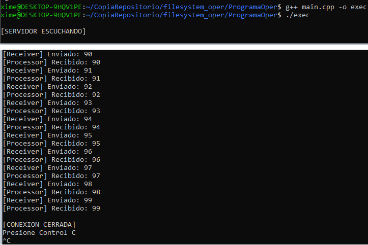
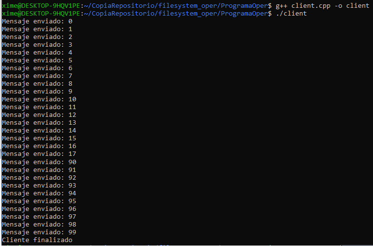

# Integrantes
Ximena Marín Sánchez C14448

Aron Hidalgo Gómez C23880

Quiann Zolfaghari Calderón C18723

Nathalie Alfaro Quesada B90221

José Pablo Mora Cubillo B75044

# Manual de usuario
Para compilar y ejecutar el presente programa, el Compilador es C++, puede utilizar el Compilador de su preferencia, por ejemplo GCC.
Para tener GCC en su computadora siga los siguientes pasos:

Abrir una nueva terminal o la terminal integrada en el IDE de su preferencia y escriba los siguientes comandos:

## Instalación
```
sudo apt update
sudo pip3 install cpplint
```

## Compilación y ejecución
Paso 1: Abrir una terminal y escribir el siguiente comando
```
g++ main.cpp -o exec
./exec
```

Paso 2: En otra terminal escriba el comando:
```
g++ client.cpp -o client
./client
```
## Impresiones en pantalla

### En main.cpp
A continuación una demostración del funcionamiento del programa



### En cliente.cpp
A continuación un **extracto de la salida**.




